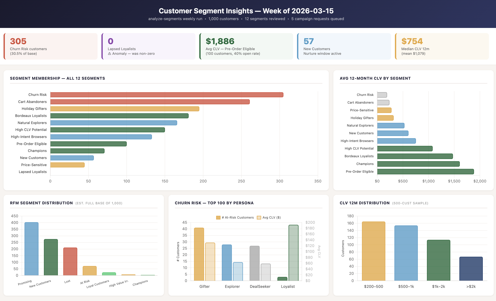

# Customer Insights — Segment Analysis

**Skills used:** `/analyze-segments`

A walkthrough of a full customer intelligence run from a single prompt. `/analyze-segments` loads all customer data from the MCP, refreshes RFM scores, CLV estimates, and churn risk tiers, reviews all 12 segment memberships, surfaces key findings with urgency tagging, writes three output reports, and queues campaign requests for `/plan-campaign` to act on — without any intermediate prompts.

---

## Step 1 — The Prompt

> */wine-marketing:analyze-segments give me insights about segments*

One prompt. The skill immediately connects to the MCP and loads:

- **500 RFM scores** — recency, frequency, and monetary value for half the customer base
- **500 CLV estimates** — 12-month lifetime value projections
- **100 churn risk records** — the highest-risk customers (score > 0.98) pulled from the full 305-member churn segment

The full dataset is 1,000 customers. The MCP returned files rather than inline data for the larger responses — so the skill used Python scripts via bash to parse and aggregate the raw data efficiently, computing averages, distributions, and persona splits without reading tens of thousands of lines directly.

Before pulling any customer data, the skill does two things first: checks the queue for already-pending campaign requests (to avoid writing duplicates) and loads the persona definitions so every segment can be mapped to its archetype — Explorer, Gifter, Loyalist, Collector, DealSeeker — before the analysis begins.

Then the seven-step plan: load data, refresh RFM distribution, update CLV tiers, compute churn risk by persona, rebuild segment membership counts, surface key findings, write reports and queue campaign requests. The plan is laid out before execution begins — the analysis is transparent and auditable at every step.

---

## Key Findings

Five findings surface, each tagged by urgency:

**🔴 Churn Risk is at 30.5% of base** — 305 customers in seg-012 (score > 0.70) are deeply disengaged, all with zero recent purchases. The top 100 score above 0.98, representing ~$9,345 in estimated 12-month revenue at risk. The most urgent recovery targets aren't the biggest group — they're the 3 **Loyalist-persona** customers, followed by 8 high-CLV Gifters (CLV > $200), who have a natural re-engagement hook: Mother's Day is ~7 weeks out.

> **Overlap note:** Cart Abandoners (seg-004, 261 customers) likely has significant overlap with Churn Risk (seg-012, 305). If so, the effectively disengaged-but-reachable cohort could exceed 400 customers — nearly half the base. The report flags this for a deduplicated count analysis before the winback campaign is sized.

**🔴 Lapsed Loyalists (seg-006) has 0 members** — flagged as an anomaly. The finding doesn't collapse it to a footnote: two explanations are presented (a prior winback campaign worked, or the segment rules are evaluating incorrectly) with a queue request prompting `/plan-campaign` to investigate. A zero-member segment that was previously active is data — silently ignoring it would be a gap.

One additional nuance on the Gifter churn cohort: the report flags that high churn scores among Gifters may be partially inflated. Gifters buy seasonally — low recency in March doesn't necessarily mean permanent disengagement; it may reflect the post-holiday lull before the spring gifting season. Mother's Day in ~7 weeks provides the re-engagement timing to test this hypothesis without a discount.

**🟡 Pre-Order Eligible (seg-011) is the highest-CLV opportunity** — 100 Loyalist and Collector-persona customers with avg CLV $1,886 and a 40% email open rate. Spring is the ideal window for a Barolo or Nebbiolo limited-allocation campaign. Importantly: no discounting. The framing for this segment is scarcity and provenance, not savings.

**🟡 New Customers (seg-009) need nurturing now** — 57 customers in the acquisition window, predominantly Explorer-persona. Without a nurture sequence, the model projects drift to Lapsed within 60–90 days. The window to intervene is open; the finding quantifies what it costs to wait.

**✅ Bordeaux Loyalists (seg-001) are primed** — 181 customers, 41% open rate, spring vintage season underway. A new-arrival campaign here has the highest projected conversion probability of any segment in the current window.

At the bottom of the findings: three links — **Customer Insights Report**, **Churn Risk Report (Top 100 with actions)**, **Run Log** — all written in the same session.

---

## The Visualization

> *create a visualization summarizing the insights*

The skill already holds all the analysis data in memory. One follow-up prompt generates a five-panel dashboard — no re-querying the MCP, no re-running the analysis.

The skill narrates what each panel shows:

**Top-left — Segment Membership (all 12 segments):** Ranked by size and colour-coded by health. The two red bars — Churn Risk (305) and Cart Abandoners (261) — dominate immediately. Lapsed Loyalists appears in purple at zero: the anomaly is visible at a glance.

**Top-right — Avg CLV by Segment:** This panel inverts the size story. The largest segments by headcount (Churn Risk, Cart Abandoners) have the lowest average CLV. The revenue lives in the smaller, greener segments: Pre-Order Eligible at $1,886, Champions at $1,609. Headcount and value point in opposite directions — a fact that wouldn't be obvious from the membership chart alone.

**Bottom-left — RFM Segment Distribution:** The full customer base health picture. ~212 "Lost" customers and ~72 "At Risk" represent near-term recovery candidates. The Promising (40.4%) and New Customer (27.6%) cohorts are the growth pool — large, and at an inflection point.

**Bottom-centre — Churn Risk Top 100 by Persona:** Gifters are the largest churn cohort (41 customers), but Loyalists have the highest average CLV ($192) despite being only 3. That asymmetry is the key strategic insight: Gifters need calendar-triggered re-engagement; Loyalists need high-touch outreach proportionally more than their headcount suggests.

**Bottom-right — CLV 12M Distribution:** The base skews mid-tier — the $500–$1k band is the sweet spot. 13.4% of the sample (67 customers) exceed $2,000 CLV — a small premium cluster that drives outsized revenue and warrants aggressive retention focus.

---

## The Reports

Three output files written in the same session:

**`customer-insights-report-2026-03-15.md`** — Executive summary: full RFM distribution across the 500-customer sample, CLV tier breakdown (13.4% above $2k), churn risk by persona, complete 12-segment membership table with CLV and engagement metrics, and the seg-006 anomaly flagged explicitly.

**`churn-risk-2026-03-15.md`** — Actionable churn report: the top 100 at-risk customers tiered into four recovery tracks using a structured action vocabulary:

| Action | Who | Approach |
|---|---|---|
| `PRIORITY_WINBACK` | 3 Loyalist-persona customers | Personalized, exclusive offer — no discount |
| `GIFTER_WINBACK` | 8 high-CLV Gifters (CLV > $200) | Seasonal occasion framing — Mother's Day hook |
| `STANDARD_WINBACK` | Explorer and Gifter CLV $50–200 | Discovery/story re-engagement — no deep discount |
| `PROMO_WINBACK` | DealSeeker customers | Promotional trigger — requires an active offer |
| `SUPPRESS` | 8 DealSeekers (CLV < $20) | Do not send — recovery value doesn't justify spend |

The action schema means the churn report isn't a list to read — it's a structured input `/send-emails` can act on directly.

**`analyze-segments-2026-03-15.md`** — Run log: the full 7-step execution trace, 12-segment review summary, 5 campaign queue requests written to `/queue`, and an explicit errors/skips section noting that the MCP currently lacks write tools for RFM, CLV, churn scores, and segment membership — so those computations are reported but not persisted back. The limitation is documented, not hidden.

---

## What This Illustrates

- **Single prompt → full analysis** — one open-ended request triggers MCP data loads, computation across RFM/CLV/churn dimensions, 12-segment review, five key findings, three reports, and five queued campaign requests
- **Size ≠ value** — the CLV-by-segment panel makes visible what a headcount view obscures: the largest segments (Churn Risk, Cart Abandoners) have the lowest CLV; the revenue lives in the small, high-engagement segments
- **Anomaly detection built in** — seg-006 at 0 members is flagged automatically and investigated, not silently ignored; the skill presents two possible explanations and queues an action either way
- **Churn tiering by persona** — recovery strategy differs by persona: Loyalists need high-touch outreach regardless of headcount, Gifters have a natural calendar hook, DealSeekers respond to offer framing; a single "churn campaign" targeting all 305 would dilute all three
- **Analysis → action in one session** — findings aren't just reported; five campaign requests are written to the queue with type, segment, rationale, and priority for `/plan-campaign` to pick up in the next run
- **Follow-up within the same context** — the visualization required no re-querying; the skill built the dashboard from data already in memory, demonstrating that a single analysis session can produce multiple output formats without redundant MCP calls

---

## Why This Architecture Made It Work

### The data model made the analysis possible

`churn_risk_score`, `clv_12m`, RFM fields, `persona`, and `lifecycle_stage` are first-class fields on every customer record in the MCP — not derived on the fly, not assembled from separate systems. That means the skill could segment, tier, and prioritize in a single MCP call rather than joining multiple sources.

The seg-006 anomaly was detectable because `member_count` is a field on segment records. The skill didn't have to infer a zero by counting members manually — it read the field and flagged the deviation. Anomaly detection here isn't a separate analytical layer; it falls out naturally from a data model that exposes the right signals.

The persona field is what makes churn tiering meaningful. 305 customers in a churn segment is a number. Knowing that 3 of them are Loyalists with avg CLV $192 while 41 are Gifters with a Mother's Day hook in 7 weeks turns a segment into a set of distinct recovery strategies with different ROI profiles.

### Structured findings → queued actions

The findings didn't stop at a report. Each finding triggered a structured queue write: a campaign request with `type`, `target_segment`, `rationale`, `priority`, and `suggested_approach`. When `/plan-campaign` runs next, it calls `get_queue_requests()` and picks up five actionable items — not a document to read and interpret, but structured inputs to reason over directly.

That's the difference between analysis that informs a human decision and analysis that feeds directly into the next step of an automated pipeline. The skill didn't just surface the Pre-Order Eligible opportunity — it queued a Barolo limited-allocation campaign request with `priority: HIGH` and a rationale that `/plan-campaign` can use to draft the brief without re-deriving the context.

### One skill, full analysis scope

`/analyze-segments` has read access to all customer data domains: RFM scores, CLV estimates, churn risk, segment membership, personas, and lifecycle stages. That breadth is what allows the cross-referencing that makes the findings useful — "Gifters are the largest churn cohort, but Loyalists have the highest avg CLV" requires joining churn risk data with persona data and CLV data in a single pass.

A narrower skill scoped to only one domain would produce correct but isolated findings. The strategic insight — that the priority winback target by CLV is not the same as the priority winback target by headcount — only emerges from the cross-domain view. The skill's access scope is calibrated to match the analytical question it's designed to answer.
